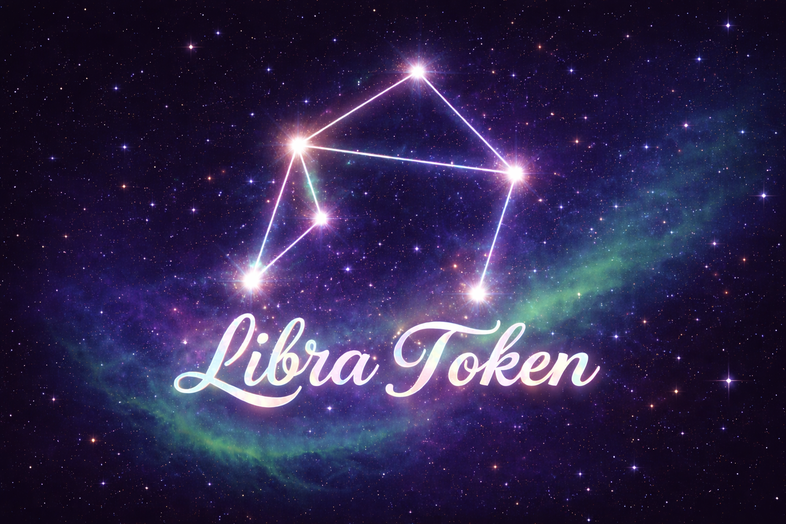

# ⚖️ Libra Token

**Mint Address:** `7GpJmA9wK7wG2hL6h9wE4d6fTt4TfER8TwBpJtRb2Vbb`  
**Symbol:** ⚖️  
**Decimals:** 6  

---

## 📑 Metadata
Token metadata is hosted on GitHub:  
➡️ [libra.json](https://raw.githubusercontent.com/BetterhavemyMonet/Libra-token/main/libra.json)

---

## 🖼 Logos
- **Primary Logo**:   
- **Alternate Logo**:   

---

## 🔄 Update Metadata
To update metadata or logos:
```bash
mpl-token-metadata update   --keypair ~/.config/solana/id.json   --mint 7GpJmA9wK7wG2hL6h9wE4d6fTt4TfER8TwBpJtRb2Vbb   --name "Libra"   --symbol "⚖️"   --uri "https://raw.githubusercontent.com/BetterhavemyMonet/Libra-token/main/libra.json"
```

---

## ℹ️ Notes
- Logo recommended size: **256×256 PNG with transparent background**  
- Phantom and Solana Explorer may take a few minutes to refresh after updates  
